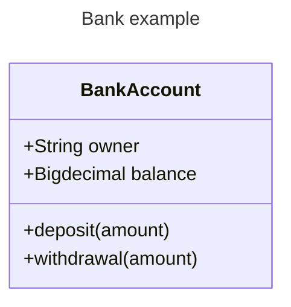
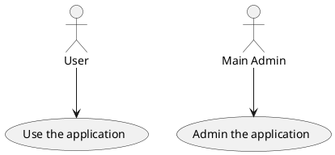

# Formatting
**Đây là bôi đậm**
*In nghiêng*
~~Gạch ngang~~
Một đoạn văn `thông thường`
> Đây là một `quotation`

# Table
| #   | Title 1   | Title 2   | Title 2 |
| --- | --------- | --------- | ------: |
| 1   | Content 1 | Content 2 |       2 |
| 2   | Content 1 | Content 2 |       2 |
| 3   | Content 1 | Content 2 |       2 |
| 4   | Content 1 | Content 2 |       2 |

# Code stype

```php
#php
echo 1
```

```sql
--sql
select * from table where abc = 1 and bcd = 'hello'
```

```js
//js
console.log(111)
console.log("Hello")
```

# Image
](image.png)

# Chart
## Mermaid



## PlantUML



# Calculation Formula

$y=x^2$

# Import file
