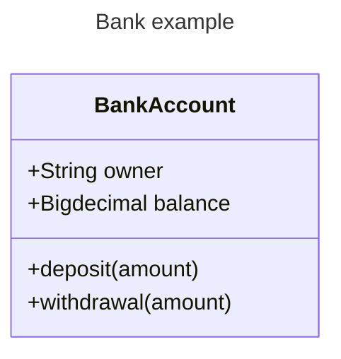
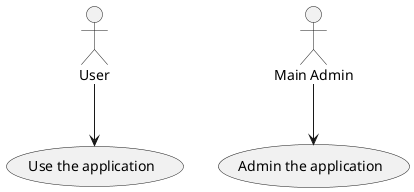

# Xin chao, my name is Nhung 🙀

## 😼 Experience
🌳 Mid-level **Business Data Analyst** at [NGV](https://ngvgroup.vn/gioi-thieu-cong-ty-co-phan-ngv/) `(Mar 2024 - Present)`.

🌱 Junior **IT Business Analyst** at [MobiFone IT](https://it.mobifone.vn/gioi-thieu) `(Nov 2022 - Nov 2023)`.

🌱 Junior **IT Business Analyst** at [TopCV](https://www.topcv.vn/brand/topcv/gioi-thieu) `(Jul 2022 - Oct 2022)`.

🌿 Fresher **IT Business Analyst** at [Viettel AI](https://viettelai.vn/ve-chung-toi) `(Oct 2021 - May 2022)`.

🌿 **IT Business Analyst** Intern at [ETC](https://www.etc.vn/ve-chung-toi) `(Jul 2021 - Aug 2021, 2 weeks)`.

🌿 **IT Business Analyst** Intern at [Tech Moss](https://techmoss.net/gioi-thieu/) `(Jun 2021 - Jul 2021, 1 month)`.

## 🐱 Domains


## 😾 Documentation


## 📄 Documentation

## 📄 Documentation

## 🕒 Education
<p>
  
  
  
</p>

**Đây là bôi đậm**
*In nghiêng*
~~Gạch ngang~~
Một đoạn văn `thông thường`
> Đây là một `quotation`

# Table
| #   | Title 1   | Title 2   | Title 2 |
| --- | --------- | --------- | ------: |
| 1   | Content 1 | Content 2 |       2 |
| 2   | Content 1 | Content 2 |       2 |
| 3   | Content 1 | Content 2 |       2 |
| 4   | Content 1 | Content 2 |       2 |

# Code stype

```php
#php
echo 1
```

```sql
--sql
select * from table where abc = 1 and bcd = 'hello'
```

```js
//js
console.log(111)
console.log("Hello")
```

# Image
](image.png)

# Chart
## Mermaid



## PlantUML



# Calculation Formula

$y=x^2$

# Import file
